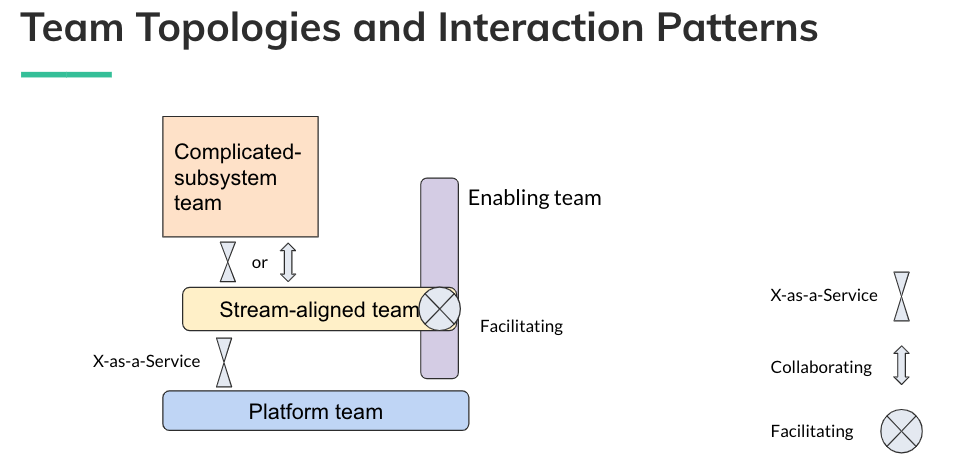
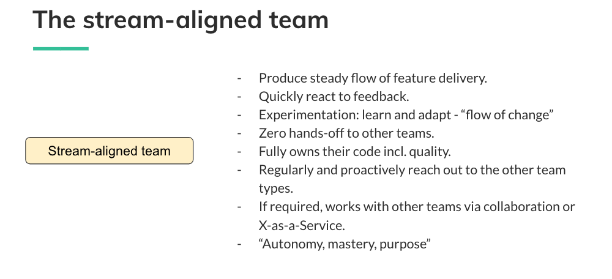
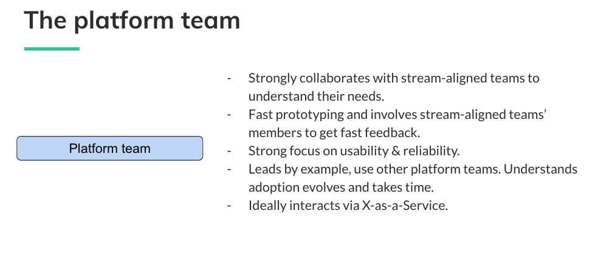
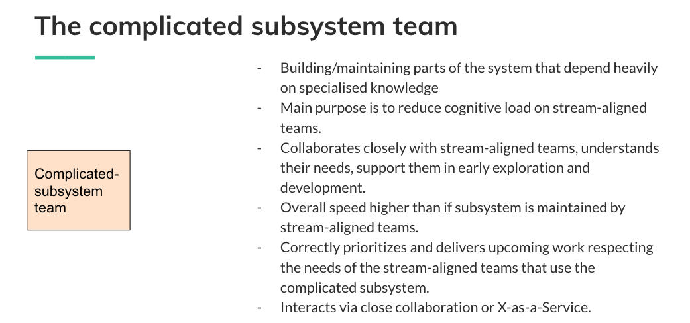
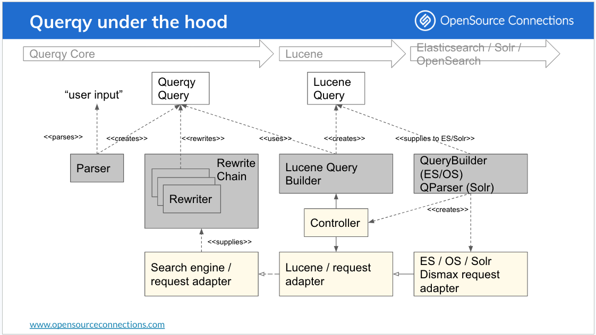

# Search Wisdom by OpenSource Connections

## Structuring Teams - Team Topologies

An optimized team structure will affect even the system design outcome, we can't attach to a single pattern that works in every case, it will depend on the organization and product.

We should:
 - Avoid feature teams
 - Build a stream in which development flows: Frontend -> Backend -> DB

### Cognitive Load & Comm Patterns

Its fundamental to make an effor to reduce cognitive load (amount of mental effort used)
    - Intrinsic: fundamental problems -> structuring a Java class
    - Extraneous: How to deploy a compoenent? How to connect to X service?
    - Germane: Specific aspects which need to be learned -> Business domain, new tech advancements

A high number of communication patterns is the ideal within a team lessening the points of communication when reaching outsidethe team.
Try to keep the teams following the 2 pizza rule ([copied of Jeff Bezo's](https://www.theguardian.com/technology/2018/apr/24/the-two-pizza-rule-and-the-secret-of-amazons-success))

### Team Types

#### Team Topologies

#### Stream Aligned Team

#### Enabling Team

#### Platform Team

#### Subsystem Team

## Vector Search

### How to combine

The best approach from a findability/relevancy perspective is to add the particular term to the generated vector, generated vectors are dependant on the generating strategy followed, eg. nDCG@30, P@30,...

### Score combination

- Sum of scores: Cosine Similarity + BM25
- RRF (Reciprocal Rank Fusion): 1/k+rank(keyword)

## Query Relaxation

Strategy followed to deal with No Results.

Usually we rely on:

- Synonyms
- Stemming
- Orthograpihc normalization
- Spellcheck
- Search in low quality fields i.e `description`
- Show related queries

The proposal is to find the best combination from the query input by the user to keep him engaged.

The conclusion after experimentation is to use a Multilayer Neural Network with Word2Vec but also to keep this as a recommendation that should be properly communicated to the user.

## Querqy Library

Library for query rewriting available in several search systems such as: opensearch, elasticsearch, Solr, ...

### How it works

### Included Capabilities via Rewriters

- Common rules: mobile -> mobile OR smartphone
- Replace: ombile -> mobile
- Number-Unit -> Laptop 15" -> laptop AND screen_size:[13.5 TO 16.5]
- Shingle: i phone -> (i phone OR iphone)
- Word Break -> grainfree -> (grainfree OR grain free)
  - Handles as well composing/decomposing German terms: arbeitsjacke -> arbeit jacke

### Customization

When working with others such as Lucene we can set custom rewrites such as:
- new* -> new
- new -> release_date:[Now-4Days TO Now+1Day]
- + -> plus
- *) -> $1 (whitespace)
- (* -> $1 (2018) -> 2018

### What it wants to achieve?

