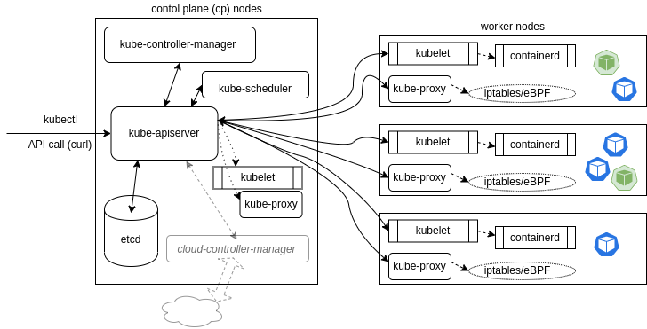
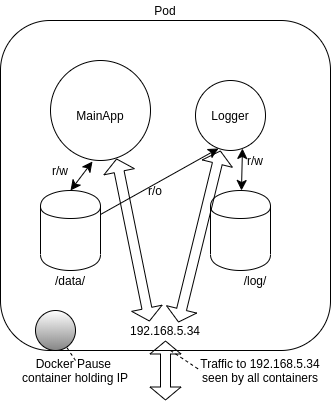

# Kubernetes for developers - Summary from course LDF259

## Objetives

- Containerize and deploy a new Python script​
- Configure the deployment with ConfigMaps, Secrets, and - SecurityContexts
- Understand multi-container Pod design
- Configure probes for Pod health
- Update and roll back an application
- Implement services and NetworkPolicies
- Use PersistentVolumeClaims for state persistence

## Kubernetes Architecture

Kubernetes is:

> an open-source system for automating deployment, scaling, and management of containerized applications

In its simplest form, Kubernetes is made of one or more __central managers__ (aka masters) and worker nodes. The manager runs an API server, a scheduler, various operators and a datastore to keep the state of the cluster, container settings, and the networking configuration.



Kubernetes exposes an API via the __API server__: you can communicate with the API using a local client called kubectl. The __kube-scheduler__ sees the API requests for running a new container and finds a suitable node to run that container. Each node in the cluster runs two components: kubelet and kube-proxy. The __kubelet__ systemd service receives spec information for container configuration, downloads and manages any necessary resources and works with the container engine on the local node to ensure the container runs or is restarted upon failure. The __kube-proxy__ pod creates and manages local firewall rules and networking configuration to expose containers on the network.

### Network

A Pod represents a group of co-located containers with some associated data volumes. All containers in a Pod share the same network namespace.




#### CNI Network Configuration File

CNI is an emerging specification with associated libraries to write plugins that configure container networking and remove allocated resources when the container is deleted.

Example:
```json
{
   "cniVersion": "0.2.0",
   "name": "mynet",
   "type": "bridge",
   "bridge": "cni0",
   "isGateway": true,
   "ipMasq": true,
   "ipam": {
       "type": "host-local",
       "subnet": "10.22.0.0/16",
       "routes": [
           { "dst": "0.0.0.0/0" }
            ]
   }
}
```


## Glossary

__container__

A container is a ready-to-run software package containing everything needed to run an application: the code and any runtime it requires, application and system libraries, and default values for any essential settings.

__pod__

Pods are the smallest deployable units of computing that you can create and manage in Kubernetes.
A Pod (as in a pod of whales or pea pod) is a group of one or more containers, with shared storage and network resources, and a specification for how to run the containers.

__namespace__

A segregation of resources, upon which resource quotas and permissions can be applied. Kubernetes objects may be created in a namespace or cluster-scoped. Users can be limited by the object verbs allowed per namespace. Also the LimitRange admission controller constrains resource usage in that namespace. Two objects cannot have the same Name: value in the same namespace.

__context__

A combination of user, cluster name and namespace. A convenient way to switch between combinations of permissions and restrictions. For example you may have a development cluster and a production cluster, or may be part of both the operations and architecture namespaces. This information is referenced from ~/.kube/config.

__Resource Limits__

A way to limit the amount of resources consumed by a pod, or to request a minimum amount of resources reserved, but not necessarily consumed, by a pod. Limits can also be set per-namespaces, which have priority over those in the PodSpec.

__Pod Security Policies__

Deprecated. Was a policy to limit the ability of pods to elevate permissions or modify the node upon which they are scheduled. This wide-ranging limitation may prevent a pod from operating properly. This was replaced with Pod Security Admission. Some have gone towards Open Policy Agent, or other tools instead.

__Pod Security Admission__

A beta feature to restrict pod behavior in an easy-to-implement and easy-to-understand manner, applied at the namespace level when a pod is created. These will leverage three profiles: Privileged, Baseline, and Restricted policies.

__Network Policies__

The ability to have an inside-the-cluster firewall. Ingress and Egress traffic can be limited according to namespaces and labels as well as typical network traffic characteristics.

## Building with Kubernetes

Currently the stadard for containerization is Docker as it was the first one on developing a wide adopted solution, but there are other alternatives more open, but not all of them cover the same scenarios:
- CR-0
- Containerd
- rkt
- Podman

### Steps
 
1. Develop or rewrite your aplication withour having into account env variables as they are going to be managed by external files later.
2. Create your Dockerfile, more info: https://docs.docker.com/engine/reference/builder/
3. Create a deployment on Kubernetes

````shell
kubectl create deployment <Deploy-Name> --image=<repo>/<app-name>:<version>

Example:
kubectl create deployment time-date --image=10.110.186.162:5000/simpleapp:v2.2
````

4. Verify your container and run commands on it

`````bash
​kubectl get pods
kubectl exec -i​t <Pod-Name> -- /bin/bash
`````

### Multi-Container Pod

Pods can have several containers which interact with each other to avoid requiring a new instance just for a little application.
- Ambassador: To communicate with outside resources, i.e: A proxy
- Adapter: To modify data generated by the primary container, i.e: A datastream modification
- Sidecar: A companion service of the main app, i.e: Logging service

### Probe types: Readiness, Liveness & Startup

- Readiness: Usefull to know when the container is ready to operate, you can use methods such as httpGET to know if a webapp returns a 200 or a exec statement to know if the app can return a zero exit code.
- Liveness: To check the health of a container, so we can spawn a new one or alert.
- Startup: Useful to test apps that requires a long time to start.

### Test

A handful tools to determine if all is working fine are:

`````bash
kubectl describe pod test1
kubectl logs test1
`````

To see the events & the app logs of the pod.

### Helm

Package manager for Kubernetes, uses one or more YAML files to describe 1 or more objects and allow them to be easily deployed in the cluster.

## Design for Kubernetes

### Characteristics
- Decoupling: Ability to isolate each service and ease connection between them.
- Transience: Ability to terminate any component of the system and start up a new one with a different, or not, version in any moment.
- Flexible framework: Instead of a monolithic component, each of the components can be divided into multiple instances of that component, several Search Services for instance, to allow workload distribution.

## Deployment Configuration

### Volumes

A pod specification can declare 1 or more volumes and where they are available.
Each requires: name, type and mount point.

For data adquired to be available to other cotainers we would need a **PersistentVolumeClaim(pvc)**, which can has several permissions over it: RWO, ROX, RWX where X stands for **Many**

#### YAML Spec Empty Vol
```yaml
apiVersion: v1
kind: Pod
metadata:
    name: busybox
    namespace: default
spec:
    containers:
    - image: busybox
      name: busy
      command:
        - sleep
        - "3600"
      volumeMounts:
      - mountPath: /scratch
        name: scratch-volume
    volumes:
    - name: scratch-volume
            emptyDir: {}
```

#### YAML Spec Shared Volume
```yaml
   containers:
   - name: alphacont
     image: busybox
     volumeMounts:
     - mountPath: /alphadir
       name: sharevol
   - name: betacont
     image: busybox
     volumeMounts:
     - mountPath: /betadir
       name: sharevol
   volumes:
   - name: sharevol
     emptyDir: {} 
```

#### YAML Spec Persistent Volume
```yaml
kind: PersistentVolume
apiVersion: v1
metadata:
name: 10Gpv01
labels:
type: local
spec:
capacity:
        storage: 10Gi
    accessModes:
        - ReadWriteOnce
    hostPath:
        path: "/somepath/data01"
```

#### YAML Spec Persistent Volume Claim
```yaml
kind: PersistentVolumeClaim
apiVersion: v1
metadata:
    name: myclaim
spec:
    accessModes:
        - ReadWriteOnce
    resources:
        requests:
                storage: 8GI
(In the Pod)
....
spec:
    containers:
....
    volumes:
        - name: test-volume
          persistentVolumeClaim:
                claimName: myclaim
```

### Secrets

Secrets are meant to encode sensitive data/passwords on a YAML file, by defaults they use **base64**. 

Can be encrypted on top of the encoding using an EncryptionConfiguration object.

```bash
$ kubectl create secret generic --help
$ kubectl create secret generic mysql --from-literal=password=root
```

```yaml
spec:
    containers:
    - image: mysql:5.5
      name: mysql
      env:
      - name: MYSQL_ROOT_PASSWORD
        valueFrom:
          secretKeyRef:
            name: mysql
            key: password
```

The encoded password can also be encrypted using

### Config Maps

A similar API resource to Secrets is the ConfigMap, except the data is not encoded. In keeping with the concept of decoupling in Kubernetes, using a ConfigMap decouples a container image from configuration artifacts.

**Uses:**

- Pod environmental variables from single or multiple ConfigMaps
- Use ConfigMap values in Pod commands
- Populate Volume from ConfigMap
- Add ConfigMap data to specific path in Volume
- Set file names and access mode in Volume from ConfigMap data
- Can be used by system components and controllers.

#### ConfigMap Definition and Use on YAML

```yaml
kind: ConfigMap
apiVersion: v1
metadata: 
    name: foobar
data:
    config.js: |
        {
```

```yaml
...

env:
- name: SPECIAL_LEVEL_KEY
  valueFrom:
    configMapKeyRef:
      name: special-config
      key: special.how
...

volumes:
  - name: config-volume
    configMap:
      name: special-config
...

```
### Scaling & Rolling Updates

Most values can be updated on a configuration, a usual one is to change the number of replicas running.
Zero means no containers, otherwise you can adjust it with:

```bash
$ kubectl scale deploy/dev-web --replicas=4
deployment "dev-web" scaled
```

If an update is made to, for example, the version of the app to deploy, a rolling update will be triggered.