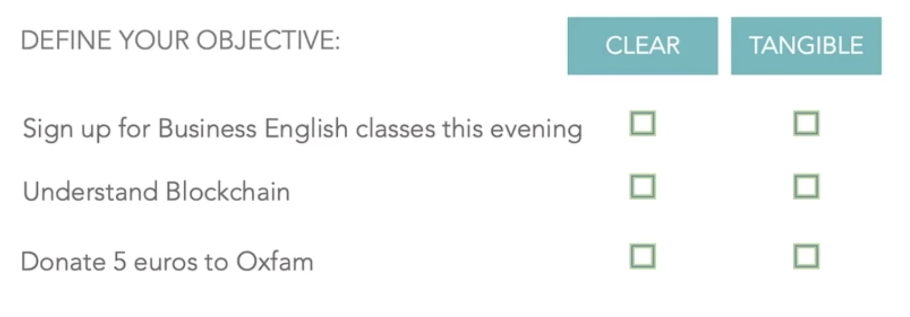
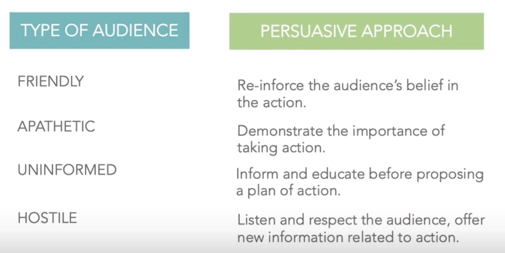
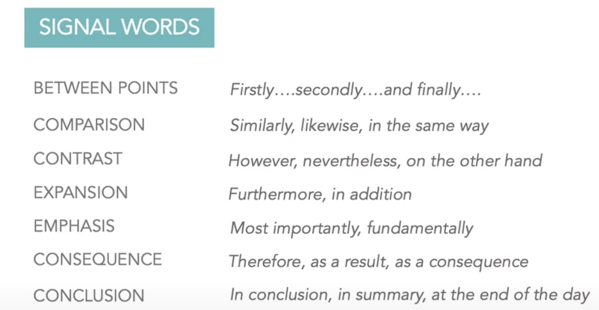
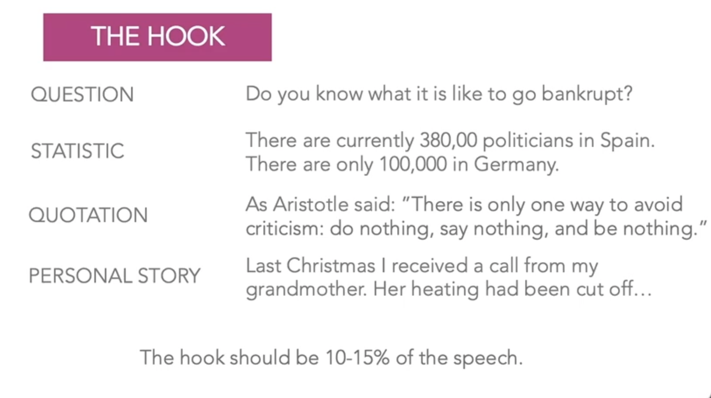
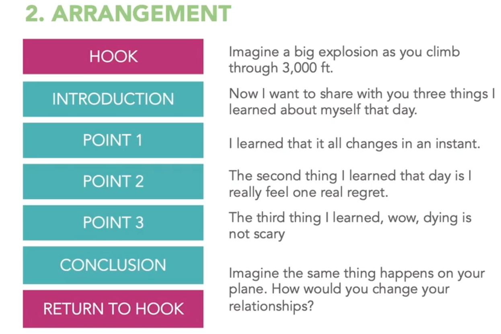

# Sam Gratton's - English Communication Skills Course Takeaways

## 

## The Five Parts of Rethoric

### Invention

#### Define your objective

Establish a clear and achievable objective, it should fit in a sentence.

1. Clear and tangible
2. Not clear, too broad so its not likely to happen
3. Clear but not specified, should be better to set it to be done during the meeting

#### Define your audience

Depending on the expected audience you should be prepared in advance to deal with them adequately:

#### Brainstorm Benefits & Obstacles
 
Bring out benefits and obstacles relating to your speech to generate a discussion, bear in mind that you're there to benefit the audience.

### Arrangment

How the order of the speech has to be determined so its effective and pleasant. 

#### Introduction

Benefits to the audience regarding what you're about to say. Why is this interesting for them?

#### 3 Points

Your 3 best points to present to the audience about your speech, they can include counter arguments, should be the most effective one can find.
Scientifically 3 is the number of things they can remember consistently.

It's important to use signal words to guide the audience and ease the flow of the discourse:

Avoid filler words: uhmm, er, so..., u know..., it's better to slow down and/or be quiet briefly to think.

#### Conclusion

Summary of the speech inciding on the motivation of the same and moving the people to act.

#### The Hook

Something to keep audience interested, done at the start and returned to it at the end: Quote, personal history, question, quotation.

#### Ted Talk 2011 Example: 3 Things I learned when my plane crashed

